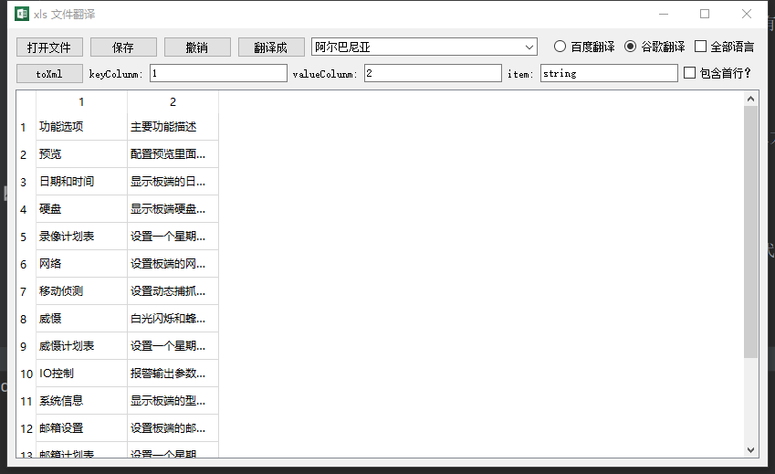
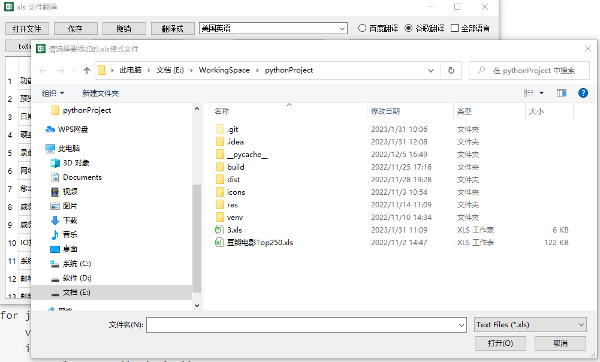
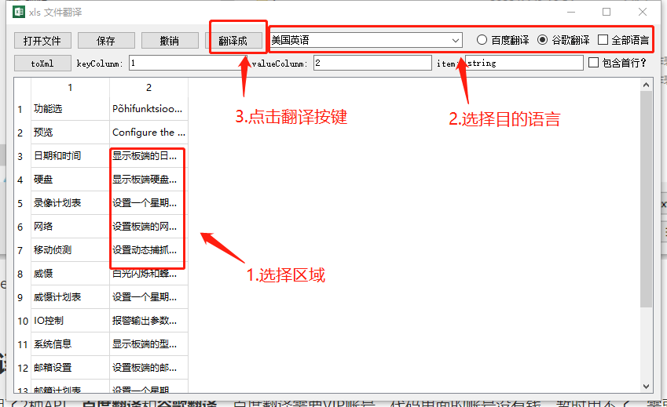
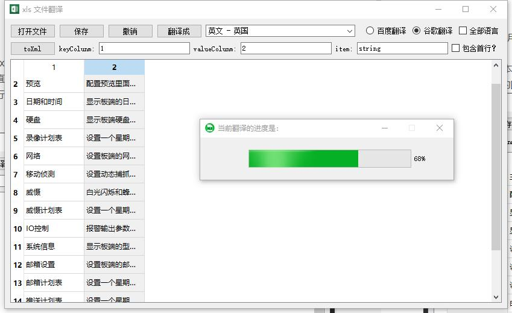

# xls文件处理器

## 背景：

Android开发里面经常要用到国际化翻译的xml文档，不同国家的客户有不同的语言翻译的需求，一般翻译都是我们提供模板给客户那边修改后直接用上，为了客户使用的直观和方便，给客户提供的文档都是xls格式的表格，回到我们这边还需要转成xml,公司提供的都是旧版2.0+版本的python文件进行转换，我不想换低版本的pycharm，就用高版本的开发pycharm3.9平台上，做一个带语言翻译的和xls转xml的图形界面工具。



我使用PyQt5来制造图形界面，可以安装插件QTdesigner来设计图形界面生成UI文件，PyUIC把UI文件转换成py文件，在主程序main里面调用生成相应的界面。具体见代码。

## 功能分析：

1. 需要读取，显示（可选择，编辑）和保存xls文档里面的内容；
2. 提供不同的翻译平台，如果数量过多，使用多线程；
3. 提供转换成xml文档的功能，可以选择具体的列做键或者值。

### xls文档处理：

python的基本API里面有提供读取xls文档的xlrd，保存xls文档的xlwt

```
//读取操作
def readXls(strpath=""):
    # print(strpath)
    global workbook
    if strpath[1] == "":
        return
    workbook = xlrd.open_workbook_xls(strpath[0][0])
    table = workbook.sheets()[0]
    # 按行读取
    tableWidget.setColumnCount(table.ncols)
    tableWidget.setRowCount(table.nrows)
    for i in range(table.nrows):
        # print(table.row_values(i))
        for j in range(table.ncols):
            value = table.cell(i, j).value
            if isinstance(value, float):
                value = str(int(value))
            tableWidget.setItem(i, j, QTableWidgetItem(value))
    return table
```




```
//保存操作
def writeXls(strpath=""):
    global workbook
    save_book = xlwt.Workbook('utf-8')
    sheet = save_book.add_sheet(workbook.sheet_names()[0])
    oldsheet = workbook.sheets()[0]
    for i in range(oldsheet.nrows):
        for j in range(oldsheet.ncols):
            sheet.write(i, j, tableWidget.item(i, j).text())
            # print(oldsheet.cell(i, j).value)
    # print(strpath)
    try:
        save_book.save(strpath[0])
    except Exception as e:
        showdialog("失败", e.args[0])
        return
    finally:
        showdialog("注意", "文件保存成功!")
```


tableWidget是一种可以编辑的表格控件，先把读取的数据写进去，可以实时修改，后面需要保存再提取数据。


### 语言翻译：

我这里使用了2种API，**百度翻译**和**谷歌翻译**，百度翻译需要VIP账号，代码里面的账号没有钱，暂时用不了，需要的人可以自己更换自己的账号来使用，谷歌翻译比百度翻译好用，免费高效，建议直接使用默认的谷歌翻译。都有提供**主流语言**和**全部语言**2种模式。

添加完文件后，可以再下面tablewidget容器里面左击或者加拖动鼠标来选择你要翻译的内容。




看看每个步骤我们做了哪些操作：

#### 1.选择区域：

这个比较简单，tableWidget能自己检测到被选定的区域，我们只需把里面的内容遍历出来后传给翻译方法进行统一的翻译。

```
translate_list = []
table = workbook.sheets()[0]
for i in range(len(tableWidget.selectedItems())):
    input_content = table.cell(tableWidget.selectedItems()[i].row(), tableWidget.selectedItems()[i].column()).value
    # 去空处理
    if len(input_content.strip()) > 0:
        tableWidget.selectedItems()[i].setText(input_content)
        translate_list.append(tableWidget.selectedItems()[i])
```

#### 2.选择目的语言：

我选择一个全局的变量来标记选中后的语言：

```
def selectTargetLanguage():
    data = readLanguageJson(mainView.main_ui.toAllLanguage.isChecked(), mainView.main_ui.toBaidu.isChecked())
    global targetLanguage
    targetLanguage = data[mainView.main_ui.comboBox.currentIndex()]['LangCultureName']
```

通过comboBox里面的选中索引值去它的数据集合里面拿对应语言缩写，赋值给全局变量targetLanguage。

#### 3.点击翻译按键：

python爬虫做翻译工作要避免被目的网站察觉，我们需要使用ip代理，如果数量庞大的网络请求（数量大于10），使用多线程能提高效率，用户体验会更好。

##### 3.1动态代理IP获取

```
# 获取代理IP
def getProxyAddress():
    proxies = []
    try:
         # 网站地址
        url = 'http://www.66ip.cn/index.html'
        head = {  # 模拟浏览器头部信息，向服务器发送消息
            "User-Agent": "Mozilla / 5.0(Windows NT 10.0; Win64; x64) AppleWebKit / 537.36(KHTML, like Gecko) Chrome / 80.0.3987.122  Safari / 537.36"
        }
        r = requests.get(url, headers=head)
        r.encoding = r.apparent_encoding
        dom = etree.HTML(r.text)
        url_path = '//td'
        urls = dom.xpath(url_path)
        for i in range(6):
            proxie = 'http://' + urls[i * 5 + 7].text + ':' + urls[i * 5 + 8].text
            proxies.append(proxie)
    except requests.exceptions.ConnectionError:
        showdialog("注意", "网络连接出现错误!")
        print("Error: unable to connect success")
    finally:
        # 检测代理IP是否有效
        urls = ["http://httpbin.org/ip", "https://www.baidu.com", "https://www.google.com.hk", "https://www.sohu.com",
                "https://mail.qq.com", "https://www.sina.com.cn", "https://mail.10086.cn", "https://www.sogou.com",
                "https://juejin.cn", "https://mail.sina.com.cn"]
        print('开始IP检测')
        global checkActiveIpNum
        checkActiveIpNum = 0
        global ActiveProxies
        ActiveProxies = []
        try:
            for i in range(len(proxies)):
                _thread.start_new_thread(checkActiveIp, (proxies[i], urls[i], len(proxies)))
        except Exception as e:
            print('start thread :' + e.args[0])
        finally:
            if len(proxies) > 0:
                print('开始多线程翻译')
                while True:
                    if checkActiveIpNum == len(proxies):
                        startTranslate(True)
                        break
            else:
                print('开始单线程翻译')
                startTranslate(False)
```

先是从免费的网站上获取到代理IP，之后一个个检测它是否有效，有效则添加到代理IP集合里面给多线程操作提供IP。如果全部无效则后续的翻译工作选择单线程翻译进行。

##### 3.2多线程请求：

```
# 并发任务进行翻译
def multiNetworkTranslate(translateList=[]):
    num = len(ActiveProxies)
    # 转整形列表
    total_pos = []
    for i in range(len(translateList)):
        total_pos.append(i)

    temp = []
    for i in range(num):
        data = []
        for j in range(len(total_pos)):
            if total_pos[j] % num == i:
                data.append(total_pos[j])
        threads = TranslateItem(i, data)
        temp.append(threads)
    for i in range(num):
        _thread.start_new_thread(networkTranslateSingle,
                                 (translateList, temp[i].content, ActiveProxies[i]))
```

```
def networkTranslateSingle(translateList=[], translateScope=[], proxy=""):
    for i in range(len(translateList)):
        if i in translateScope:
            networkRequest(translateList[i], len(translateList), proxy)
```

谷歌翻译网络请求的间隔为50毫秒。

```
def googleTranslate(translateItem: QTableWidgetItem, len=0, proxies=""):
    try:
        # 网站地址：谷歌翻译
        url = 'https://translate.google.hk/translate_a/single?client=gtx&sl=auto&tl=' + targetLanguage + '&dt=t&q=' + \
              translateItem.text()
        head = {  # 模拟浏览器头部信息，向豆瓣服务器发送消息
            "User-Agent": "Mozilla / 5.0(Windows NT 10.0; Win64; x64) AppleWebKit / 537.36(KHTML, like Gecko) Chrome / 80.0.3987.122  Safari / 537.36"
        }
        # 用户代理，表示告诉豆瓣服务器，我们是什么类型的机器、浏览器（本质上是告诉浏览器，我们可以接收什么水平的文件内容）
        proxies_wrap = {'http': proxies}
        # 获取网页
        r = requests.get(url, headers=head, proxies=proxies_wrap)
        if r.status_code == 200:
            load = json.loads(r.text)
            result = load[0][0][0]
            print("the %s translates is :%s" % (translateItem.text(), result))
            tableWidget.setItem(translateItem.row(), translateItem.column(), QTableWidgetItem(result))
            global translateNum
            translateNum = translateNum + 1
            progress = int(translateNum / len * 100)
            print("the progress is %s:", progress)
            worker = threading.Thread(target=progressbarChange(progress))
            worker.start()
        else:
            showdialog("注意", r.text)
    except requests.exceptions.ConnectionError:
        print("Error: unable to start thread")
    time.sleep(0.05)
```

百度翻译需要更多的间隔时间：800毫秒，容易出现非必现的网络请求失败错误，建立失败内容集合，再次进行百度翻译请求：

```
def baiduTranslate(translateItem: QTableWidgetItem, length=0, proxy=""):
    proxies_wrap = {'http': proxy}
    url = 'http://api.fanyi.baidu.com/api/trans/vip/translate'
    appid = '20190906000332471'
    apikey = 'X4wgwMaf7bVZIqBz9Kv7'
    salt = random.randint(32768, 65536)
    sign = make_md5(appid + translateItem.text() +
                    str(salt) + apikey)
    headers = {'Content-Type': 'application/x-www-form-urlencoded'}
    payload = {'appid': appid, 'q': translateItem.text(), 'from': 'auto',
               'to': targetLanguage, 'salt': salt, 'sign': sign}
    global translateProgress
    translateProgress = translateProgress + 1
    global failureTranslates, so
    try:
        r = requests.post(url, params=payload, headers=headers, proxies=proxies_wrap)
        if r.status_code == 200:
            result = r.json()
            if 'error_code' in result:
                print("error_code:" + result)
                failureTranslates.append(translateItem)
            else:
                if translateItem in failureTranslates:
                    failureTranslates.remove(translateItem)
                tableWidget.setItem(translateItem.row(), translateItem.column(),
                                    QTableWidgetItem(result["trans_result"][0]['dst']))
                global translateNum
                translateNum = translateNum + 1
                progress = int(translateNum / length * 100)
                print("the progress is %s:", progress)
                worker = threading.Thread(target=progressbarChange(progress))
                worker.start()
        else:
            showdialog("注意", r.text)
    except Exception as e:
        print(e)
        failureTranslates.append(translateItem)
    finally:
        print(str(len(failureTranslates)))
        t = threading.currentThread()
        print('last Thread id : %d' % t.ident)
        if translateProgress == length and length > translateNum:
            print(failureTranslates)
            worker = threading.Thread(target=processChange(length))
            worker.start()
    time.sleep(0.8)
```

开始翻译后会有进度条弹框出现，后者在全部任务结束后会自动关闭。


进度条的刷新使用信号发送具体的参数。

### xls转xml：

直接选择列数作为xml文档里面的key和value的值，点击toXml就可以转换。

具体代码实现如下：

```
def convertxls():
    if workbook is None:
        showdialog("注意", "请先打开一个.xls格式的文件!")
    else:
        sheets_ = workbook.sheets()[0]
        contentxls = '<?xml version="1.0" encoding="utf-8"?>\n<resources>\n'
        # eg:  <string name="authentication_title">Two-factor Authentication</string>
        if mainView.main_ui.includeHeader.isChecked():
            for i in range(sheets_.nrows):
                if len(sheets_.cell(i, int(mainView.main_ui.keyEdit.text()) - 1).value) > 0:
                    contentxls += '\t<string name="' + str(
                        sheets_.cell(i, int(mainView.main_ui.keyEdit.text()) - 1).value) + '">' \
                                  + str(
                        sheets_.cell(i, int(mainView.main_ui.valueEdit.text()) - 1).value) + '</string>\n'
        else:
            for i in range(sheets_.nrows):
                if len(sheets_.cell(i, int(mainView.main_ui.keyEdit.text()) - 1).value) > 0 and i > 0:
                    contentxls += '\t<string name="' + str(
                        sheets_.cell(i, int(mainView.main_ui.keyEdit.text()) - 1).value) + '">' \
                                  + str(
                        sheets_.cell(i, int(mainView.main_ui.valueEdit.text()) - 1).value) + '</string>\n'
                else:
                    continue
        contentxls += '</resources>'
        print(contentxls)

        savefile_name = QFileDialog.getSaveFileName(None, "保存文件", "./", "Text Files (*.xml);;All Files (*)")
        if len(savefile_name[0]) > 0:
            savexml = open(savefile_name[0], 'w', encoding="utf-8")
            ret = savexml.write(contentxls)
            if ret > 0:
                showdialog("注意", "文件转换成功!")
            else:
                showdialog("注意", "文件转换失败!")
            savexml.close()
```
